 How America Flies ? - Creating Insightful Visualizations on Airline Performance Data
================

Part 1. Introduction
================

We all love to travel and when it comes to deciding the itinerary of our next vacation, a major deciding factor in booking flight tickets is the budget. When we are constrained on a budget, we choose to go for the cheapest flight or the destination that offers maximum holiday discounts. We also hope that the flight that we choose is dependable and reliable.

Many times, the only information that is available to us on the travel booking website is travel time and flight price. But, we have no way to find out whether the flight is reliable or not. The idea of doing Data analysis and visualisation on flight reliability occurred to us when we were booking our flights tickets to India for the 2018 winter break. We noticed that we had no information on the historical flight data indicating delays and flight cancellations, which made us extra cautious while booking the tickets

<p align="center">
  
</p>

Logically, it would make sense for the airlines not to disclose this data to the customer who is booking the flight ticket because they are looking to sell maximum number of tickets and availability of this information might damage their ticket sales. For a customer, on the other hand, this information is crucial when he/she is choosing a particular airline and destination city. For example, knowledge of various airline performance may give him/her options to avoid cancellation or delays of his/her flights

Through our analysis, we would like to present a general overview of flight on-time performance in the continental United States and a special focus will be given to show how one can use this analysis to plan their travel this December. We will also try to answer questions such as; What is the right time to travel to avoid getting stuck at airports? Which airlines should be avoided for a particular route because of poor performance?

### Team Members:

-   Akhil Punia (ap3774)
-   Ameya Karnad (ak4251)
-   Aishwarya (av2845)
-   Anirudh Bharadwaj (cb3441)

Part 2. Description of Data
======================

Data Collection
---------------

In this section, we will talk about how the data was collected and preprocessed.

-   First, we tried to find data which contained information about international flights. The international flight on time performance data was not freely available. Hence, we had to fall back on air travel data for the United states only, which was freely available.

-   The data that we are using for our data analysis and visualisation is taken from United States Department of Transportation's Bureau of Transportation Statistics (BTS) <https://transtats.bts.gov/Tables.asp?DB_ID=120&DB_Name=Airline%20On-Time%20Performance%20Data&DB_Short_Name=On-Time>. The collected data is sampled from the period of October 2017 to September 2018. We restricted purself to this timescale because the dataset is very large and it gives trouble after loading in R to do quick operatoins.

-   The data consists of discrete attributes such as Origin and Destination airport, Airline details, Flight number and Cancellation codes to name a few. It also has continuous attributes such as Delay time, distance, taxi and wheels on/ off time.

-   First, the data was preprocessed to pick a few attributes that we wanted to analyse and other were discarded. This was done using python. The Python script used to preprocess data is given in the link <ameyareplace>

-   In the data visualisation part for the interactive component, the dataset was preprocessed and summarised to convert tabublar data into dictionaries. This process will be explained in detailed while explaining the interractive conponent.

Part 3. Analysis of Data Quality
===========================

In this section, we will talk about the quality of data that was we used for our analyis.

The data that we used for the analysis was of good quality since it was mantained by the US Department of Transportation and we were not able to discover any signs data corruption or missing values at random. The specific columns which did contain the NaN values, had them because they been placed there logically.

``` r
extracat::visna(year_data)
```

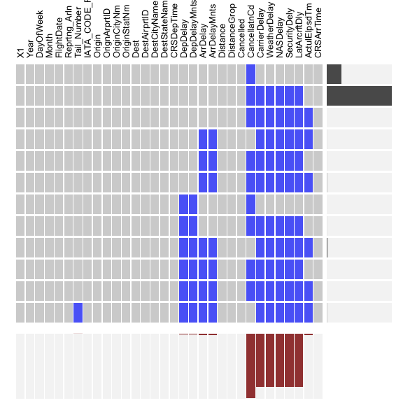

Almost all of the data that is missing belongs to the columns related to either Delay or Cancellations. This is expected as flights which are cancelled have no delay information, and flights which are delayed or ontime have no cancellation records.

Part 4. Main Analysis - Exploratory Data Analysis
============================================

In this section, we will talk about the exploratory data analysis that was done on this data.

As mentioned before, we had a set of questions that we wanted to answer as part of the project. This section is divided into various subsections, each looking at a different perspective of data.

4.1 Introduction
----------------

First, Let's look at some statistics on Air Travel.

### Figure 4.1.1: Statistics on Air Travel

``` r
df <- year_data

# Total number of flights

# Number of inbound flights per state
so <- c("DestStateName")
ms_df_o <- df %>% select(so) %>% group_by(DestStateName) %>% summarise(n())
names(ms_df_o)[2] <- "outbound"
names(ms_df_o)[1] <- "region"

# Number of outbound flights per state
sd <- c("OriginStateName")
ms_df_d <- df %>% select(sd) %>% group_by(OriginStateName) %>% summarise(n())
names(ms_df_d)[2] <- "inbound"
names(ms_df_d)[1] <- "region"

# Merging the dataframes for inbound and outbound flights
ms_df_tot <- merge(x = ms_df_d,y=ms_df_o,on="region",all=TRUE)
ms_df_tot$value <- ms_df_tot$outbound + ms_df_tot$inbound


names(ms_df_tot)[1] <- "region"
ms_df_tot$region  <- tolower(ms_df_tot$region)

# Plotting the choropleth map for total number of flights per state
state_choropleth(ms_df_tot,legend = "Number of flights", num_colors = 9) +
  ggtitle("Which states are big on flying?",
       subtitle = "Number of Inbound and Outbound flghts per state in 2017")+
  labs(caption = "Source: http://www.bts.gov/help/aviation/") +  
  theme(plot.title = element_text(face = "bold")) +
  theme(plot.subtitle = element_text(face = "bold", color = "grey35")) +
  theme(plot.caption = element_text(color = "grey68"))
```

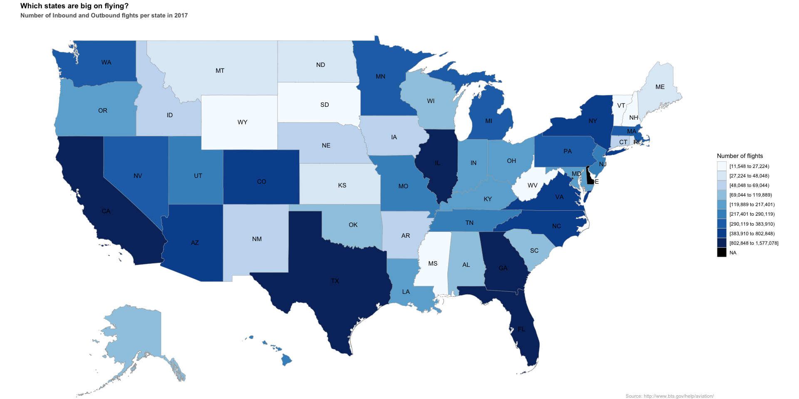

Most of the domestic air traffic in continental United States passes through these 5 states - California, Illinois, Georgia, Florida and Texas. No suprise these states are the home to the largest and the busiest airports.
 
4.2 Dominance
-------------

Domination of an air route or air traffic is an important factor to find out the way america prefers to fly. While some airlines focus their operations primarily on the major cities in the United states, there are some which specialise in regional routes by serving the tier 2 and tier 3 cities. In this section, we will try to identify the players that dominate the national airline traffic and which others eye for regional domination.

### Figure 4.2.1: Checking Available Airline Options to choose from at Leading Airports

``` r
data$Reporting_Airline <- factor(data$MKT_UNIQUE_CARRIER,
                                  levels = c("UA","AS","DL","B6","AA","F9","G4","HA","NK","VX","WN"),
                                  labels = c('United','Alaska','Delta','Jet Blue', 'American', 'Frontier','Allegiant','Hawaiian','Spirit','Virgin Atlantic', 'Southwest'))

data2 <- data %>% select( ORIGIN, DEST, MKT_UNIQUE_CARRIER,FL_DATE, DEP_TIME )
sel1 <- data2 %>% group_by( ORIGIN ) %>% dplyr::summarise( total = n() ) %>% arrange( desc( total ) )

top9airports <- sel1$ORIGIN[1:9]

newdata <- data2[ which(data2$ORIGIN %in% top9airports), ]
newdata$ORIGIN <- factor(newdata$ORIGIN,
levels = c("ATL","ORD","DFW","DEN","LAX","CLT","PHX","SFO","SEA"),
labels = c('Atlanta','Chicago','Dallas Forth Worth','Denver','Los Angles','Charlotte','Phoenix','San Francisco','Seattle'))

grp <- newdata %>%
  group_by(ORIGIN, MKT_UNIQUE_CARRIER) %>%
  dplyr::summarise(Freq = n()) 

ggplot(grp, aes(x=MKT_UNIQUE_CARRIER,y= Freq ))+
  geom_bar(position = "dodge", stat = "identity") +
  facet_wrap(~ORIGIN)+
  ggtitle("Can we choose the airline we fly ?",
          subtitle = "Total no. of Flights operated by Domestic Carriers originating from 9 Busiest Airports") +
  labs(x="Airlines",y = "Daily Flights", caption = "Source: http://www.bts.gov/help/aviation/") +
  theme(plot.title = element_text(face = "bold")) +
  theme(plot.subtitle = element_text(face = "bold", color = "grey35")) +
  theme(plot.caption = element_text(color = "grey68"))+
  theme(axis.text.x = element_text(angle = 45, hjust = 1))
```

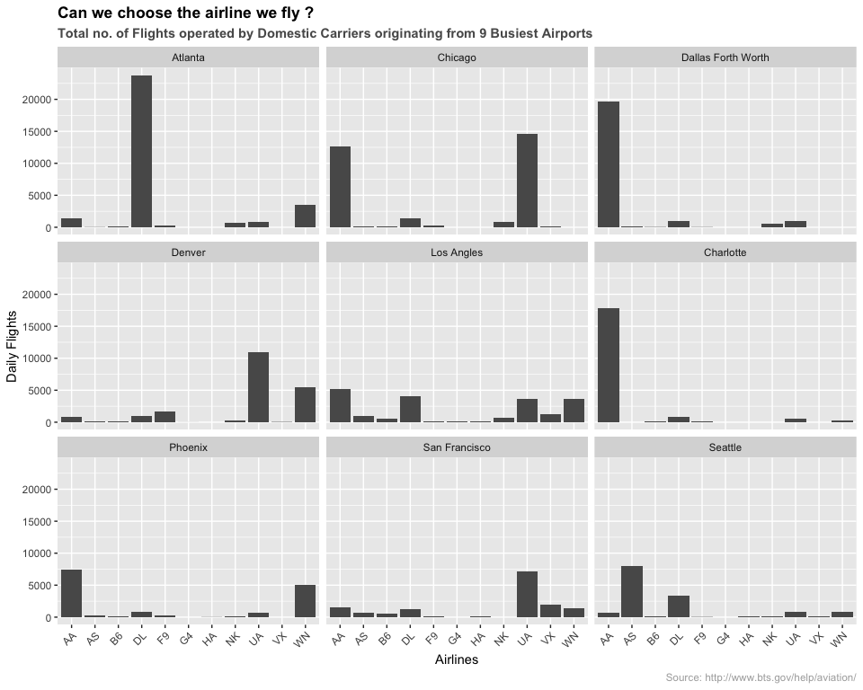

-   We see that some airlines are the only major option at a specific airport.For ex: In Atlanta most of the flights are operated by Delta, while in Dallas and Seattle, American Airlines is the biggest operator.
-   In Phoenix, Los Angles and San Francisco there is no single largest airline. More Options to choose from. 

### Figure 4.2.2: Exploring patterns in Airline Routes ?

``` r
subnewdata <-newdata[ which(newdata$DEST %in% top9airports), ]

subnewdata$DEST <- factor(subnewdata$DEST,
levels = c("ATL","ORD","DFW","DEN","LAX","CLT","PHX","SFO","SEA"),
labels = c('Atlanta','Chicago','Dallas Forth Worth','Denver','Los Angles','Charlotte','Phoenix','San Francisco','Seattle'))

subnewdata <-subnewdata %>% group_by(ORIGIN, DEST) %>% 
  mutate(Freq = n()) 
subnewdata <-subnewdata %>% group_by(ORIGIN, DEST) %>% 
  mutate(Total = sum(Freq)) %>% ungroup() 

newdata2 <- subnewdata %>% transform( routes=paste(ORIGIN,'-', DEST))
newdata3 <- newdata2 %>%group_by(routes) %>% dplyr::summarise(total=n())%>% arrange(desc(total))

rts <- c("San Francisco - Los Angles",              
"Los Angles - Seattle   ",          
"Seattle - San Francisco",              
"Denver - Los Angles",          
"Los Angles - Phoenix",         
"Atlanta - Chicago",                
"Chicago - Los Angles",             
"Phoenix - Denver",     
"Los Angles - Dallas Forth Worth",              
"Dallas Forth Worth - Chicago")
newdata3 <- newdata2 %>% filter(routes %in% rts)

grp3 <- newdata3 %>%
  group_by(routes, MKT_UNIQUE_CARRIER) %>%
  dplyr::summarise(Freq = n()) 

names(grp3)[2] <- 'Airlines'

ggplot(grp3, aes(x= routes, y= Freq, fill= Airlines ))+
  geom_bar(position = "dodge", stat = "identity") +
  ggtitle("What options do I have?",
          subtitle = "Breakdown of Airlines serving the Top 10 Busiest Domestic Air Routes [ January 2018 ]") +
  labs(x="Top 10 Busiest Routes",y = "Total No. of Flights", caption = "Source: http://www.bts.gov/help/aviation/") +
  theme(plot.title = element_text(face = "bold")) +
  theme(plot.subtitle = element_text(face = "bold", color = "grey35")) +
  theme(plot.caption = element_text(color = "grey68"))+
  theme(axis.text.x = element_text(angle = 45, hjust = 1))+
  scale_color_viridis_d()
```

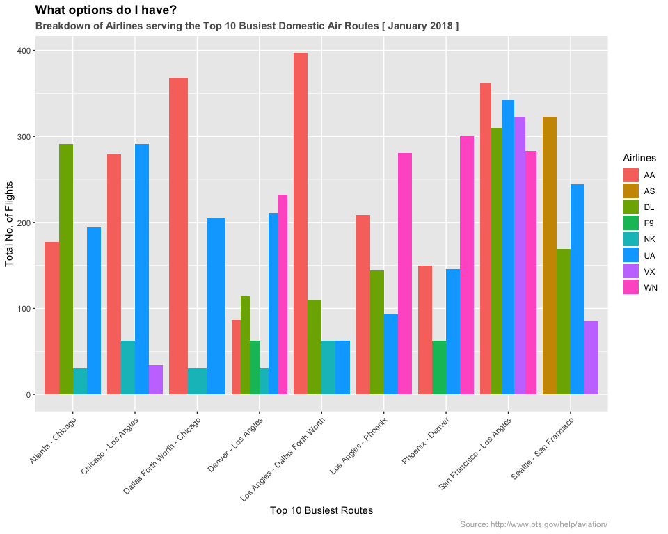

-   United Airlines serves all the routes.
-   San Franciso - Los Angeles is the busiest Domestic Air Route.
-   There are region specific airlines like Southwest which serves only in the Southern States and Alaska Airlines which is present only in Seattle - SF route.

### Figure 4.2.3.1: Routes and Unique Routes

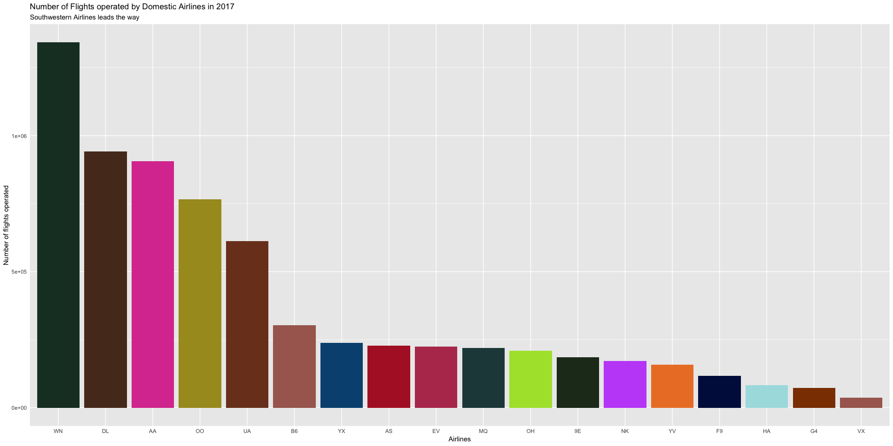

-   The Graph shows that Southwestern Airline is dominating the scene for the total number of flights operated in United States.
-   It is followed by Delta Airlines, American Airlines, SkyWest Airlines and United Airlines.

Note: This data is for the reporting airlines and not marketing airlines.Parts of Skywest Airlines are marketed as American Airlines, Delta Airlines, and others are marketed as United Airlines.

### Figure 4.2.3.2: Routes and Unique Routes

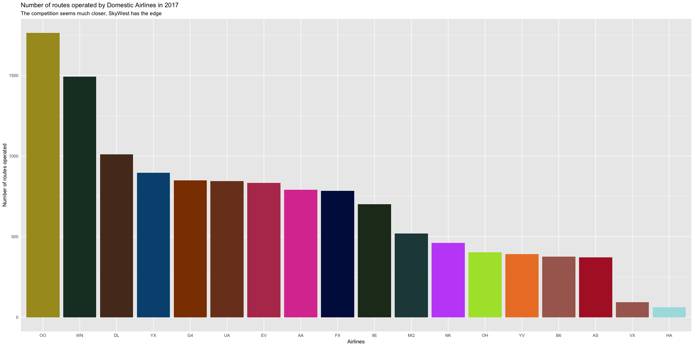

-  Despite running less than two thirds of number of operations run by Southwestern Airlines, Skywest Airlines runs on most number of unique routes in the United States.
-  It can be inferred that Skywest is running operations to many cities of the United States than any other airlines.

### Figure 4.2.4: Cleveland Plot

``` r
top_from <- unique(air_data %>% 
  select(Origin, Dest)) %>%
  group_by(Origin) %>%
  summarise(count = n()) %>%
  arrange(desc(count)) %>%
  head(50)

ggplot(top_from, aes(x = count, y = reorder(Origin, count))) +
  geom_point(color = "blue") +
  theme(axis.ticks.y = element_blank(),plot.title = element_text(size = rel(1.2))) +
  labs(x = "Number of airports connected", y = "Airport",
       title = "Top 20 airports by connectivity to other airports",
       subtitle = "O'Hare, Dallas Ford, Atlanta, and Denver are the most connected airports")
```

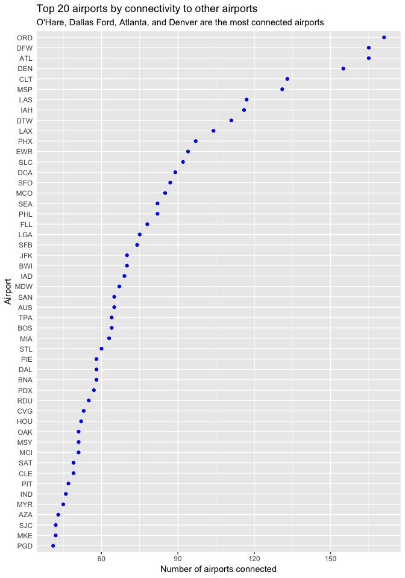

-   The Top 20 Airports with respect to the number of airports that they are connected to show an interesting picture. Chicago O'Hare International Airport is the most connected airport in the US with flights to 172 different airports. It is followed by Dallas, Atlanta and Denver Airport.
-   It is interesting to know that airports located in the West coast are not that well connected as compared to other airports. The most connected Airport on the west coast comes at 10th place (Los Angles Internation Airport- LAX)nationally.
-   Another interesting fact is that despite being the Financial Capital of the World, the 2 aiports serving New York City come at a dismal 20th and 22nd place in terms of connectivity.

### Figure 4.2.5: Alluvial Plot

``` r
exp <- year_data %>% dplyr::filter(Origin== "JFK", DepDelayMinutes > 60)
list1<- unique(exp$Dest)
#list1
#length(list1)
subset1  <- year_data[! is.na(year_data$CancellationCode),] %>% select(Year, Month, FlightDate, Origin, Reporting_Airline, CancellationCode) 

subset1$CancellationCode <- as.factor(subset1$CancellationCode)
levels(subset1$CancellationCode) <- c("Carrier","Weather","National Air System","Security")

top10aircodes <- c('JFK', 'ATL', 'SEA', 'SFO', 'LAX', 'PHX','DEN', 'DFW', 'ORD', 'CLT' )

top9airlines <- c('9E','AA','B6','DL','MQ', 'OH', 'OO', 'UA','VX')
top6airlines <- c('9E','AA','B6','DL', 'OO', 'UA')
```

``` r
decset1 <- december_data[! is.na(december_data$CancellationCode), ] %>% 
  select(Year, Month, DayofMonth, Origin, Reporting_Airline, CancellationCode) 

decset1$CancellationCode <- as.factor(decset1$CancellationCode)
levels(decset1$CancellationCode) <- c("Carrier","Weather","National Air System","Security")

decset2 <- decset1 %>% group_by(Year,DayofMonth, CancellationCode) %>% 
  summarise( count = n() )
```

``` r
library(ggalluvial)

decset3 <- decset1 %>% filter(Origin =='LGA') %>% group_by(Year,DayofMonth, CancellationCode) %>% summarise( count = n() )

demo <- year_data %>% filter( Origin %in% top10aircodes, Dest %in% top10aircodes, Reporting_Airline %in% top6airlines) %>%
  group_by( Origin, Dest, Reporting_Airline) %>% 
  summarise(Freq= n()) 

demo$Reporting_Airline <- as.factor(demo$Reporting_Airline)
levels(demo$Reporting_Airline) <- c("Endeavour", "American", "JetBlue", "Delta", "Skywest", "United")
```

``` r
ggplot(demo, aes(y = Freq, axis1 = Origin, axis2 = Reporting_Airline, axis3 = Dest)) +
  geom_alluvium(aes(fill = Reporting_Airline), width = 1/12) +
  geom_stratum(width = 1/12, fill = "white", color = "black") +
  geom_label(stat = "stratum", label.strata = TRUE) +
  scale_x_discrete(limits = c("Origin Airport", "Airlines","Desination Airport"), expand = c(.05, .05)) +
  scale_fill_brewer(type = "qual", palette = "Dark2") +
  ggtitle("The Big Three - American, Delta and United.")+
  labs(subtitle="Airport Connections visualised with airlines serving different routes",y = "No. of Flights", caption = "Source: bts.transtats.gov") +
  theme(plot.title = element_text(face = "bold")) +
  theme(plot.subtitle = element_text(face = "bold", color = "grey35")) +
  theme(plot.caption = element_text(color = "grey68"))+
  theme(axis.text.x = element_text(angle = 0))
```

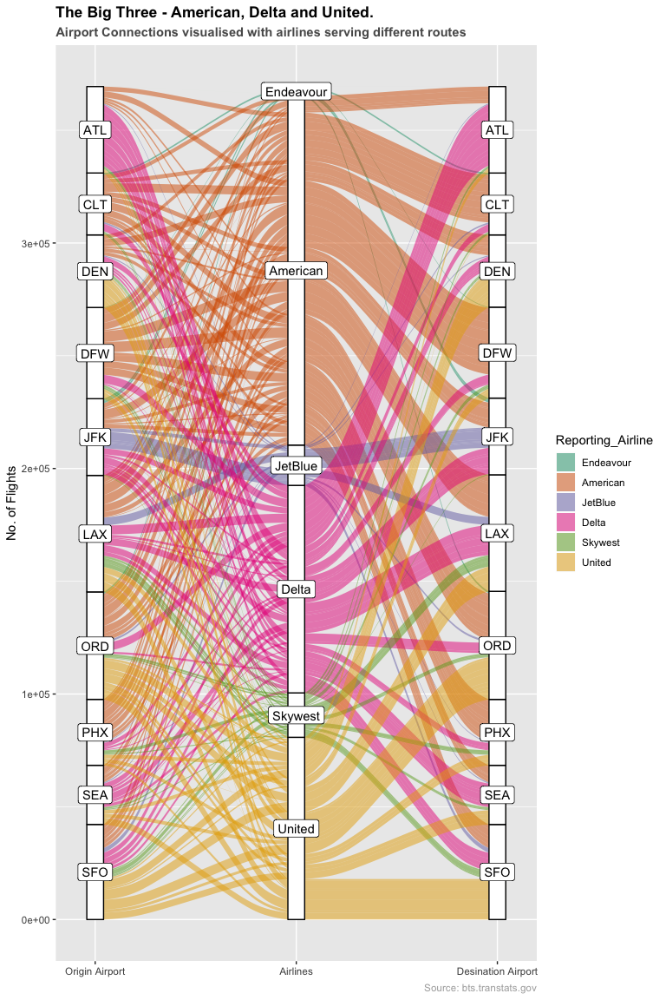

-   We can see a clear domination of three major airlines - United , Delta and United on the nation's most busiest airports.
-   Skywest Airlines is restricted to the West Coast.
-   JetBlue only serves specifically on the New York to Los Angeles route.

4.3 Delay
---------

In this subsection we will look at the various attributes that have contribute towards flight delays. We will also check if there are factors that correlate with delay.

### Figure 4.3.1: Scatter Plot - Delay vs.Distance

``` r
ggplot(exp, aes(y = Distance, x = DepDelayMinutes))+
  geom_point(alpha = 0.5)+  
  ggtitle("Does Flight Distance and Delay correlate? ",
          subtitle = "Reasons of Flight Cancelllation of Top 9 Airlines at 10 Busiest Airports") +
  labs(y = "Flight Distance ( in Kms )",x= "Departure Delays (in minutes)", caption = "Source: bts.transtats.gov") +
  theme(plot.title = element_text(face = "bold")) +
  theme(plot.subtitle = element_text(face = "bold", color = "grey35")) +
  theme(plot.caption = element_text(color = "grey68"))
```

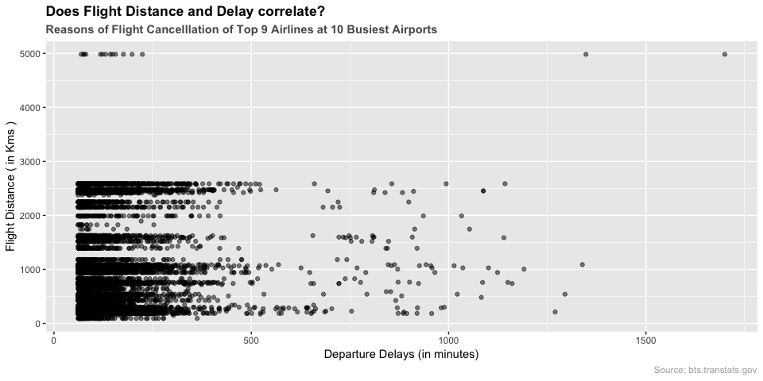

-   We see that there no specific correlation between the distance of a flight and the delay it may suffer.
-   The Worst delay that a medium and short range flight can suffer from ranges between 500 mins - 1000 mins. That is anywhere between 8.5 Hrs to 16 Hrs.

### Figure 4.3.2.1 : Ridgeline Plot ( Time of Delay )

``` r
library(tidyverse)
library(ggridges)
december <- december_data

december$FlightDate <- as.Date(december$FlightDate,"%Y-%m-%d")
december_new <- december[december$OriginAirportID == 12478,]
december_new$day <- format(as.Date(december_new$FlightDate,"%Y-%m-%d"),"%d")
december_new$day <- as.integer(december_new$day )

# Filter flights between the dates 21-31 that have delayed departing flights 
delayed <- december_new %>% 
           select("Year","DepDelayMinutes","day") %>% 
           filter(DepDelayMinutes > 0) %>% 
           filter(day>=21 & day<=31)

# Plot 
ggplot(delayed, aes(x=day,y=Year,group=Year))+
    geom_density_ridges(fill="red",alpha=0.4)+
    scale_x_continuous(breaks=21:31) + 
    ggtitle("Planning for christmas holiday trips from JFK?",
      subtitle = "Departure delays from JFK in the last 11 days of december every year") +
    labs(x="Day of the Month",y = "Year", caption = "Source: http://www.bts.gov/help/aviation/") +
    theme(plot.title = element_text(face = "bold",size=20)) +
    theme(plot.subtitle = element_text(face = "bold", color = "grey35",size=15)) +
    theme(plot.caption = element_text(color = "grey68"))+
    theme(axis.text.x = element_text(size=12)) +
    theme(axis.text.y = element_text(size=12)) +
    theme(axis.title.x = element_text(size=17)) +
    theme(axis.title.y = element_text(size=17)) 
```

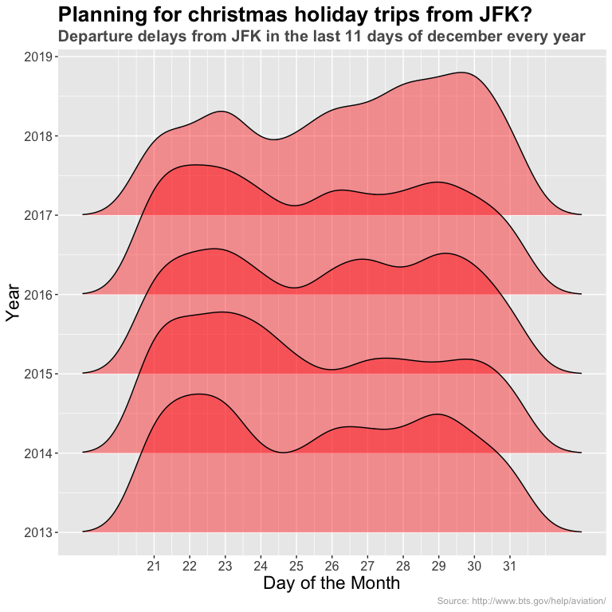

-   The above plot presents information on the volume of departing flights that get delayed in JFK in the holiday season (last 11 days in the month of December).
-   Major observation from the above graph is that there are delays invariably on all the days between 21st and 31st Decemeber.
-   Most delays occured on 22nd and 23rd of december consistently in all 5 years, while it uniformly drops a little on 25th.
-   Surprisingly, breaking the trend, the volume of delays in 2017 on the 30th of December has been very high.

### Figure 4.3.2.2 : Ridgeline Plot ( Time of Delay )

``` r
december$FlightDate <- as.Date(december$FlightDate,"%Y-%m-%d")
december_new <- december[december$OriginAirportID == 12953,]
december_new$day <- format(as.Date(december_new$FlightDate,"%Y-%m-%d"),"%d")
december_new$day <- as.integer(december_new$day )

# Filter flights between the dates 21-31 that have delayed departing flights
delayed <- december_new %>% 
           select("Year","DepDelayMinutes","day") %>% 
           filter(DepDelayMinutes > 0) %>% 
           filter(day>=21 & day<=31)

# Plot
ggplot(delayed, aes(x=day,y=Year,group=Year))+
    geom_density_ridges(fill="red",alpha=0.4)+scale_x_continuous(breaks=21:31) +   
    ggtitle("Planning for christmas holiday trips from LGA?",
        subtitle = "Departure delays from LGA in the last 11 days of december every year") +
    labs(x="Day of the Month",y = "Year", caption = "Source: http://www.bts.gov/help/aviation/") +
    theme(plot.title = element_text(face = "bold",size=20)) +
    theme(plot.subtitle = element_text(face = "bold", color = "grey35",size=15)) +
    theme(plot.caption = element_text(color = "grey68"))+
    theme(axis.text.x = element_text(size=12)) +
    theme(axis.text.y = element_text(size=12)) +
    theme(axis.title.x = element_text(size=17)) +
    theme(axis.title.y = element_text(size=17)) 
```

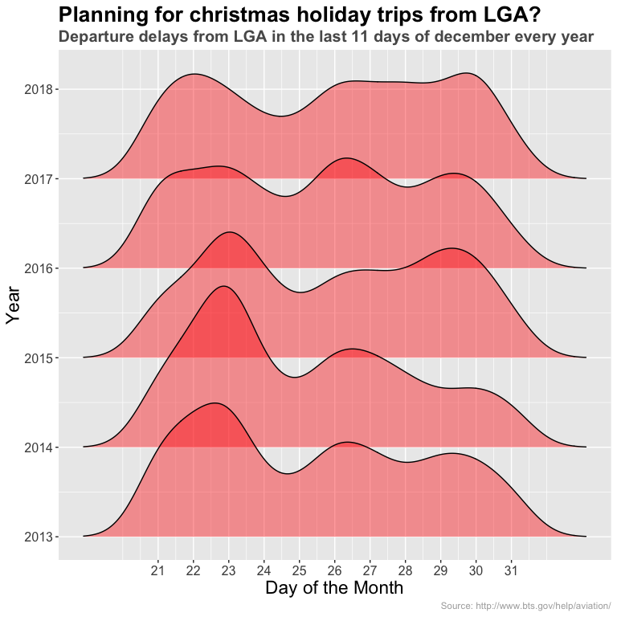

-   The same pattern seen for JFK is observed here. The large number of delays in these days may be explained by bad weather conditions.

### Figure 4.3.2.3 : Number of Flights delayed during different times of day for 7 days of the week

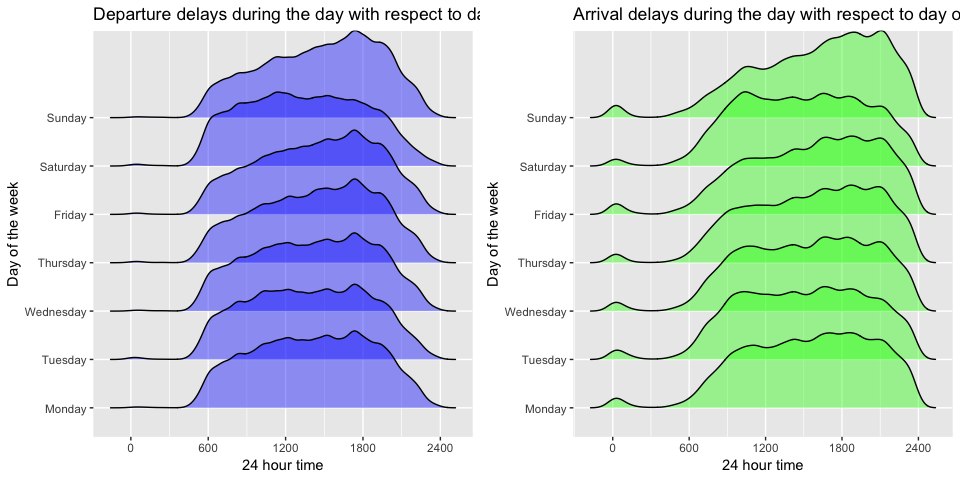

-   The trend in the departure shows that that there are no delays in flights from 0 to 5 AM. This may be because of less frequency of flights scheduled at that moment.
-   The departure delays seem to be at its highest around 3 PM and 7 PM.
-   The Arrival delays seem to be at its highest around 5 PM to 9 PM, which seems logical as the flights that had a delayed departure seem to arrive later than scheduled.
-   There also seems to be small hike in arrival delays during the midnight. This also corroborates our previous logic that flights having a delayed depearture have delayed arrival as well.

### Figure 4.3.3: Choropleth - Delay Minutes per state

``` r
# Statewise delays
df_statewise_delay_arr <- group_by(df,Reporting_Airline,OriginStateName) %>% summarise_at(vars(ArrDelayMinutes), funs(sum(., na.rm=TRUE)))
df_statewise_delay_dep <- group_by(df,Reporting_Airline,DestStateName) %>% summarise_at(vars(DepDelayMinutes), funs(sum(., na.rm=TRUE)))

names(df_statewise_delay_arr)[2] <- "state"
names(df_statewise_delay_dep)[2] <- "state"

names(df_statewise_delay_arr)[3] <- "value"
names(df_statewise_delay_dep)[3] <- "value"

# Count the number of delay minutes per state for Outbound Flights 
plt_new_dep <- df_statewise_delay_dep %>% group_by(state) %>% summarise(value = sum(value))
plt_new_dep$region <- tolower(plt_new_dep$state)

# Count the number of delay minutes per state for Inbound Flights
plt_new_arr <- df_statewise_delay_arr %>% group_by(state) %>% summarise(value = sum(value))
plt_new_arr$region <- tolower(plt_new_arr$state)

names(plt_new_arr)[2] <- "Inbound"
names(plt_new_dep)[2] <- "Outbound"

# Merge the dataframes for both Inbound and Outbound Flights
df_del <- merge(x = plt_new_dep,y=plt_new_arr,on="region",all=TRUE)
df_del$value <- df_del$Outbound + df_del$Inbound

# Plotting the cummulative delay minutes per state
state_choropleth(df_del,legend = "Delay Minutes", num_colors = 9) + 
  ggtitle("Which states are notorious for delays?", subtitle = "Number of Delay minutes per state in 2017")+
  labs(caption = "Source: http://www.bts.gov/help/aviation/") +  
  theme(plot.title = element_text(face = "bold")) +
  theme(plot.subtitle = element_text(face = "bold", color = "grey35")) +
  theme(plot.caption = element_text(color = "grey68"))
```

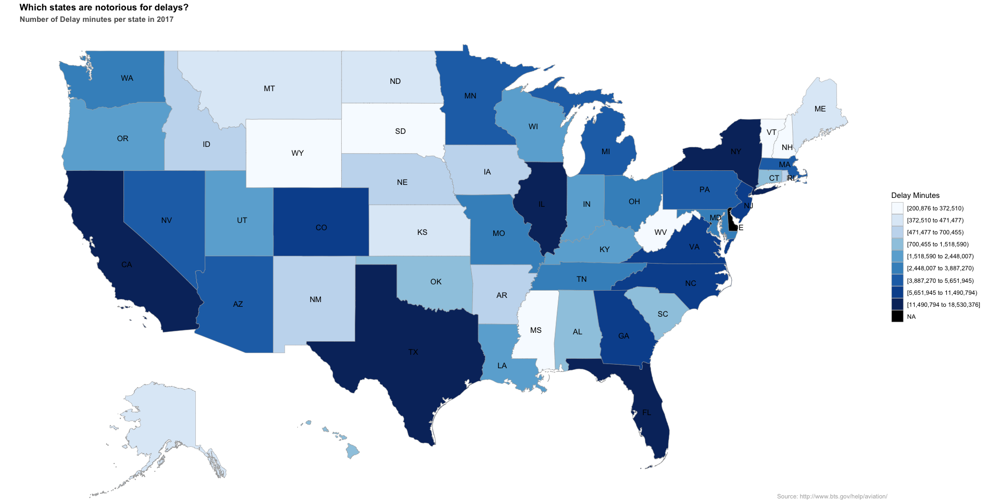 

The total number of delayed minutes seem to be dramatially concerntrated to New York, California, Texas, Miami and Illinois.

### Figure 4.3.4.1 : Choropleth - Delay with Seasons \[October - December'2017\]

``` r
dat3 <- year_data
dat3[is.na(dat3)] <- 0
states <- rownames(state.x77)
```

``` r
dat2 <- dat3 %>% filter(Month %in% c(10,11,12)) %>% group_by(OriginStateName) %>% summarize(value =  mean(DepDelay) ) 
dat4 <- dat2[dat2$OriginStateName %in% states,]
dat4 <- rbind(dat4, c("Delaware", 0))
dat4 <- rbind(dat4, c("district of columbia", 0))
dat4$OriginStateName <- tolower(dat4$OriginStateName)
colnames(dat4) <- c("region","value")
dat4$value <- sapply(as.numeric(dat4$value), round,2)

state_choropleth(dat4,legend = "Delay Time Scales")+
  ggtitle("Average Flight Delays | Period: October - December 2017",
          subtitle = "Average delay times assocaited with different states") +
  labs(y = "No. of Flights", caption = "Source: bts.transtats.gov") +
  theme(plot.title = element_text(face = "bold")) +
  theme(plot.subtitle = element_text(face = "bold", color = "grey35")) +
  theme(plot.caption = element_text(color = "grey68"))
```

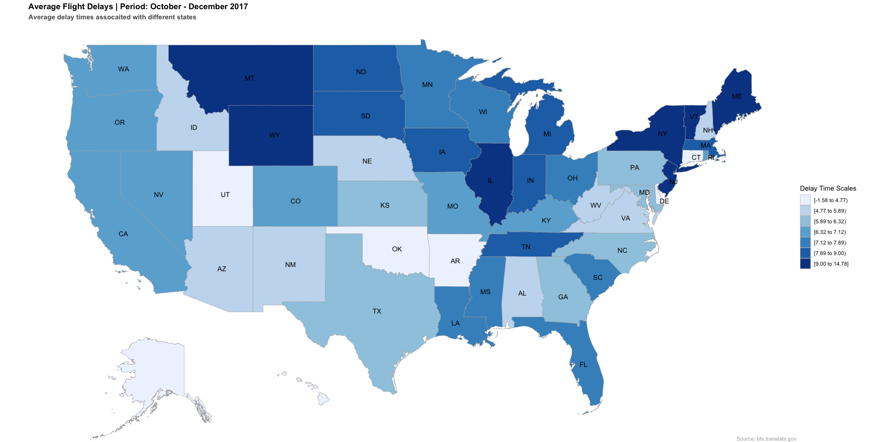

-   Period of October to December is usually the onset of Winters where we also observes two biggest festivals - Thanksgiving and Christmas.
-   Northern and Eastern Coast states are the Worst Hit due to maily extreme weather.
-   Illinois is the home of Chicago O'Hare airport and thus suffers the worst delays due to a misture of factors- high traffic andsevere weather conditions.

### Figure 4.3.4.2: Choropleth - Delay with Seasons \[January - March'2018\]

``` r
dat2 <- dat3 %>% filter(Month %in% c(1,2,3)) %>% group_by(OriginStateName) %>% summarize(value =  mean(DepDelay) ) 
dat4 <- dat2[dat2$OriginStateName %in% states,]
dat4 <- rbind(dat4, c("Delaware", 0))
dat4 <- rbind(dat4, c("district of columbia", 0))
dat4$OriginStateName <- tolower(dat4$OriginStateName)
colnames(dat4) <- c("region","value")
dat4$value <- sapply(as.numeric(dat4$value), round,2)

state_choropleth(dat4,legend = "Delay Time Scales")+
  ggtitle("Average Flight Delays | Period: January - March 2018",
          subtitle = "Average delay times assocaited with different states") +
  labs(y = "No. of Flights", caption = "Source: bts.transtats.gov") +
  theme(plot.title = element_text(face = "bold")) +
  theme(plot.subtitle = element_text(face = "bold", color = "grey35")) +
  theme(plot.caption = element_text(color = "grey68"))
```

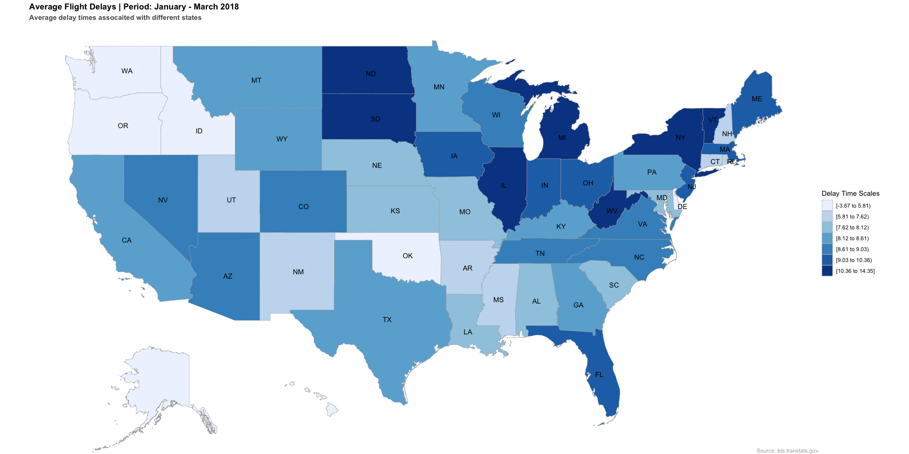

-   In January to March, when Northen United States suffers the brunt extreme winters. We see Washington, Idaho and Oregon beat the trend and rather deliver better performance.
-   We see New York and Illinois reamin the worst affected even in this part of the year.
-   North and South Dakota , Michigan and West Virginia also suffers from extreme delays.

### Figure 4.3.4.3: Choropleth - Delay with Seasons \[April - June'2017\]

``` r
dat2 <- dat3 %>% filter(Month %in% c(4,5,6)) %>% group_by(OriginStateName) %>% summarize(value =  mean(DepDelay) ) 
dat4 <- dat2[dat2$OriginStateName %in% states,]
dat4 <- rbind(dat4, c("Delaware", 0))
dat4 <- rbind(dat4, c("district of columbia", 0))
dat4$OriginStateName <- tolower(dat4$OriginStateName)
colnames(dat4) <- c("region","value")
dat4$value <- sapply(as.numeric(dat4$value), round,2)

state_choropleth(dat4,legend = "Delay Time Scales")+
  ggtitle("Average Flight Delays | Period: April - June 2018",
          subtitle = "Average delay times assocaited with different states") +
  labs(y = "No. of Flights", caption = "Source: bts.transtats.gov") +
  theme(plot.title = element_text(face = "bold")) +
  theme(plot.subtitle = element_text(face = "bold", color = "grey35")) +
  theme(plot.caption = element_text(color = "grey68"))
```

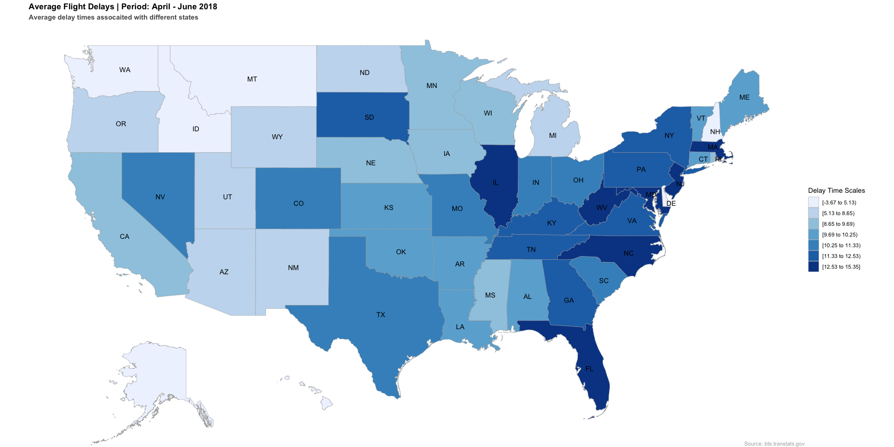

-   April to June is the beginning of summer and we can see the difference as the performance of airports in northern United States improves with the exception of East coast.
-   Florida is the worst affected state at this time of the year, owing to the fact that it is the preferred holiday destination for Americans. Simply due to the increase in air traffic at this time of the year, the average delay takes a hit.

### Figure 4.3.4.4: Choropleth - Delay with Seasons \[July - August'2017\]

``` r
dat2 <- dat3 %>% filter(Month %in% c(7,8,9)) %>% group_by(OriginStateName) %>% summarize(value =  mean(DepDelay) ) 
dat4 <- dat2[dat2$OriginStateName %in% states,]
dat4 <- rbind(dat4, c("Delaware", 0))
dat4 <- rbind(dat4, c("district of columbia", 0))
dat4$OriginStateName <- tolower(dat4$OriginStateName)
colnames(dat4) <- c("region","value")
dat4$value <- sapply(as.numeric(dat4$value), round,2)

state_choropleth(dat4,legend = "Delay Time Scales")+
  ggtitle("Average Flight Delays | Period: July - September 2018",
          subtitle = "Average delay times assocaited with different states") +
  labs(y = "No. of Flights", caption = "Source: bts.transtats.gov") +
  theme(plot.title = element_text(face = "bold")) +
  theme(plot.subtitle = element_text(face = "bold", color = "grey35")) +
  theme(plot.caption = element_text(color = "grey68"))
```

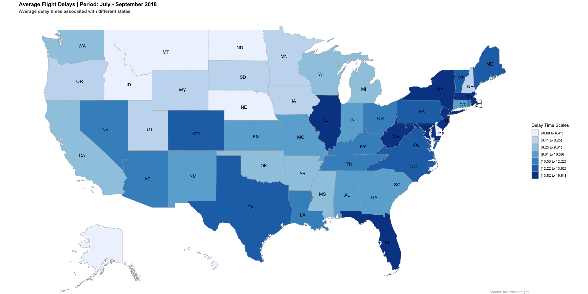

-   Patterns at this time of the year seem to be closely mirror the preceding period as there is still some Sunshine left to enjoy before the onset of winters.

### Figure 4.3.5 : Bar Chart: Count of Delay/On time/Before Time for Continental United States

``` r
# Plot of Delay

df$dep_cat[df$DepDelay >15] <- 1
df$dep_cat[df$DepDelay <0] <- -1
df$dep_cat[df$DepDelay <=15 & df$DepDelay >=0] <- 0

df$arr_cat[df$ArrDelay >15] <- 1
df$arr_cat[df$ArrDelay <0] <- -1
df$arr_cat[df$ArrDelay <=15 & df$ArrDelay >=0] <- 0

# Chart 1 for departing/outbound flights for National

df_dvg1 <- df %>% group_by(Month,dep_cat) %>% summarize(n())
names(df_dvg1)[3] <- "count"
df_dvg1 <-df_dvg1 %>% drop_na()
df_dvg1$dep_cat <- as.factor(df_dvg1$dep_cat)
df_dvg1$Month <- as.factor(df_dvg1$Month)


df_dvg1$Status[df_dvg1$dep_cat==0] <- "On Time"
df_dvg1$Status[df_dvg1$dep_cat==1] <- "Delayed"
df_dvg1$Status[df_dvg1$dep_cat==-1] <- "Before Time"

ch1 <- ggplot(df_dvg1,aes(x=Month,y=count,fill=Status)) + geom_bar(stat = "Identity",position="dodge") + 
  ylab("Frequency") + 
  theme_gray(16) +
  labs(title="What is the performance of Outbound flights?",
       caption = "Source: http://www.bts.gov/help/aviation/",
       subtitle = "Outbound Delay per month") +  
  theme(plot.title = element_text(face = "bold")) +
  theme(plot.subtitle = element_text(face = "bold", color = "grey35")) +
  theme(plot.caption = element_text(color = "grey68"))

#ggsave("Outbound Delay per month.png")

# Chart 2 for arriving/inbound flight for National

df_dvg2 <- df %>% group_by(Month,arr_cat) %>% summarize(n())
names(df_dvg2)[3] <- "count"
df_dvg2 <-df_dvg2 %>% drop_na()
df_dvg2$arr_cat <- as.factor(df_dvg2$arr_cat)
df_dvg2$Month <- as.factor(df_dvg2$Month)

df_dvg2$Status[df_dvg2$arr_cat==0] <- "On Time"
df_dvg2$Status[df_dvg2$arr_cat==1] <- "Delayed"
df_dvg2$Status[df_dvg2$arr_cat==-1] <- "Before Time"

ch2 <- ggplot(df_dvg2,aes(x=Month,y=count,fill=Status)) + geom_bar(stat = "Identity",position="dodge") + 
  ylab("Frequency") + 
  theme_gray(16) +
  labs(title="And Inbound flights?",
       caption = "Source: http://www.bts.gov/help/aviation/",
       subtitle = "Inbound Delay per month") +  
  theme(plot.title = element_text(face = "bold")) +
  theme(plot.subtitle = element_text(face = "bold", color = "grey35")) +
  theme(plot.caption = element_text(color = "grey68"))


grid.arrange(ch1, ch2, nrow = 1)
```

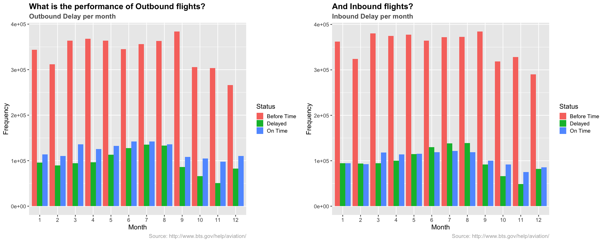

-   There is a reduction in the number of flights opereated during winters.
-   The number of delayed flights decrease substantially in the month of October and peak around the summer months suprisingly.

4.4: Cancellations
------------------

Now lets look at what each passenger wanting to go home dreads. Cancellation! We will look at where do most of the flights get cancelled and the main reasons for this cancellation.

### Figure 4.4.1 : Reasons of Flight Cancelllation of Top 9 Airlines at 10 Busiest Airports

``` r
subset2 <- subset1 %>% filter(Origin %in% top10aircodes, Reporting_Airline %in% top9airlines)

subset2$Reporting_Airline <- as.factor(subset2$Reporting_Airline)
levels(subset2$Reporting_Airline) <- c("Endeavour", "American", "JetBlue", "Delta", "Envoy", "PSA Airline", "Skywest", "United", "Virgin")

ggplot(subset2, aes(x= Origin, fill=CancellationCode))+
  geom_bar(position = "dodge")+
  facet_wrap(~Reporting_Airline)+ 
  ggtitle("Why do flights get cancelled?",
          subtitle = "Reasons of Flight Cancelllation of Top 9 Airlines at 10 Busiest Airports") +
  labs(y = "No. of Flights", x = "Origin Airports", caption = "Source: bts.transtats.gov") +
  theme(plot.title = element_text(face = "bold")) +
  theme(plot.subtitle = element_text(face = "bold", color = "grey35")) +
  theme(plot.caption = element_text(color = "grey68"))+
  theme(axis.text.x = element_text(angle = 45, hjust = 1))
```

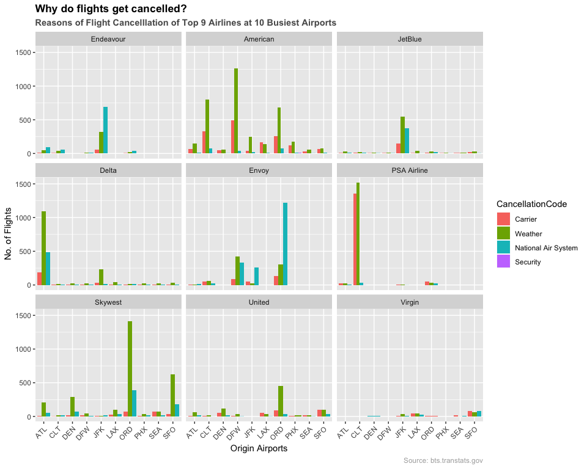

-   American Airlines (AA) suffers lots of cancellations due to carrier related and weather issue at Charlotte (CLT), Dallas (DFW) and Chicago(ORD) which also happen to be its hub airports.
-   In contrast to AA, domestic airline Skywest has cancellations at its hub in Chicago but majorly due to weather and not due to its own problem.
-   Another example is Envoy Air, which being a domestic carrier is deprioratised over national carriers when it comes to making decisons on giving space on the runway during extreme conditions. Thus, a majority of their delays come due to airport problems.

### Figure 4.4.2 : Reasons of Flight Cancellation of Top 3 Airlines at 10 Busiest Airports

``` r
subset4 <- subset1 %>% group_by(FlightDate, CancellationCode) %>% 
  summarise( count = n() )

ggplot(subset4, aes(x=FlightDate, y = count))+ 
  geom_line() + 
  facet_wrap(~CancellationCode)+
  ggtitle("Weather wrecks Air Travel ?",
          subtitle = "Flight Cancellation Patterns over the Last year") +
  labs(y = "No. of Flights", caption = "Source: bts.transtats.gov") +
  theme(plot.title = element_text(face = "bold")) +
  theme(plot.subtitle = element_text(face = "bold", color = "grey35")) +
  theme(plot.caption = element_text(color = "grey68"))+
  theme(axis.text.x = element_text(angle = 45, hjust = 1))
```

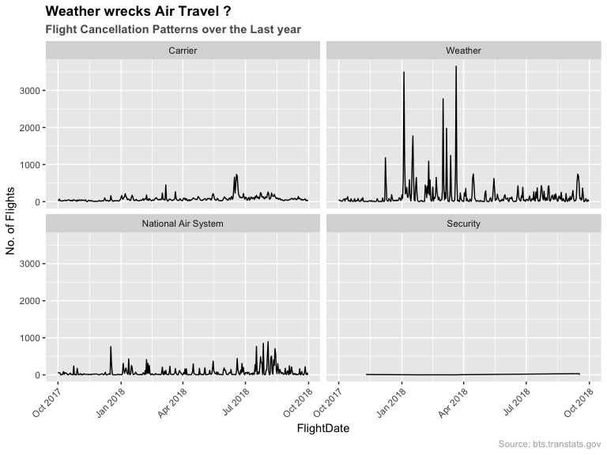

This graph shows the reasons for all flight cancellations in the United States.
-   As we know, most of the cancellation happen due to poor weather conditions.
-   The National Air System and Carrier are nearly equal responsible for the flight cancellations.

### Figure 4.4.3 : Flight cancellations across United Sates in last 5 Decembers

``` r
ggplot(decset2, aes(x=DayofMonth, y = count, color= CancellationCode))+ 
  geom_line() + 
  facet_wrap(~Year)+
  ggtitle("Winter kills Holidays, year after year!",
          subtitle = "Flight cancellations across United Sates in last 5 Decembers") +
  labs(y = "No. of Flights", caption = "Source: bts.transtats.gov") +
  theme(plot.title = element_text(face = "bold")) +
  theme(plot.subtitle = element_text(face = "bold", color = "grey35")) +
  theme(plot.caption = element_text(color = "grey68"))+
  theme(axis.text.x = element_text(angle = 45, hjust = 1))
```

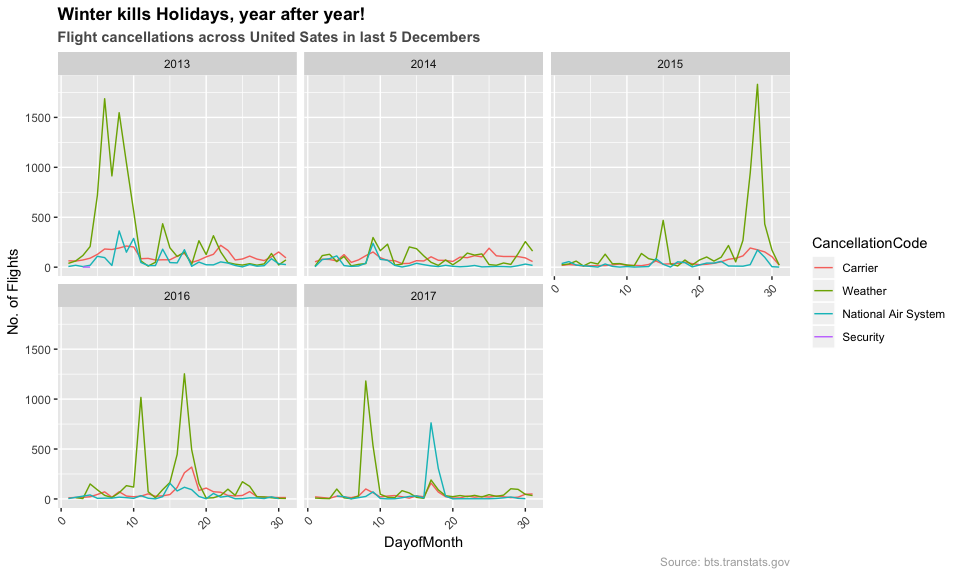

-   There were a lot of cancellations in the year 2013 in early December.
-   2015 was a bad year as lots of flights were cancelled during the holiday season.
-   Except in mid December 2017, National air carrier cancellation were always less than weather cancellations.

### Figure 4.4.4.1 : Heatmap Cancellations -Origin ( Airports vs. Day of Week )

``` r
library(viridis)
airlines <-  year_data
air <- airports

# Top 10 originating airports based on number of originating flights
new_air_origin <- airlines %>% 
                  group_by(Origin) %>% 
                  summarise(count = n()) %>% 
                  arrange(desc(count)) %>% 
                  head(10)

# Filter originating flights from that dataset that are cancelled 
cancelled_org <- airlines %>% 
                 select(Origin,Cancelled,DayOfWeek) %>% 
                 filter(Cancelled > 0) %>% 
                 group_by(Origin,DayOfWeek) %>% 
                 summarise(number_cancelled = n()) 

# Filter rows that belong to top 10 originating airports
new_can_origin <- cancelled_org[cancelled_org$Origin %in% new_air_origin$Origin,]

# Select the rows needed to figure out airport name from air dataset
air_updated <- air %>% select(airport,iata)

# Find airport names for the respective origins using IATA from air dataset
cancelled_origin <- left_join(new_can_origin,air_updated,by=c("Origin" = "iata"))
cancelled_origin$DayOfWeek <- as.factor(cancelled_origin$DayOfWeek)

# Recode the day number to day names
cancelled_origin$DayOfWeek <- recode(cancelled_origin$DayOfWeek, "1"="Monday", "2"="Tuesday", "3"="Wednesday", "4"="Thursday", "5"="Friday", "6"="Saturday", "7"="Sunday")

# Plot the heatmap
ggplot(cancelled_origin,aes(y=airport,x=DayOfWeek,fill=number_cancelled)) + 
    geom_tile(color="white") +
    ggtitle("Planning for a smooth travel without cancellations?",
          subtitle = "Number of departing flight cancellations in top 10 airports on each day") +
    labs(x="Day of the Week",y = "Airport", caption = "Source: http://www.bts.gov/help/aviation/") +
    theme(plot.title = element_text(face = "bold",size=20)) +
    theme(plot.subtitle = element_text(face = "bold", color = "grey35",size=15)) +
    theme(plot.caption = element_text(color = "grey68"))+
    theme(axis.text.x = element_text(angle = 45, hjust = 1,size=12)) +
    theme(axis.text.y = element_text(size=12)) +
    theme(axis.title.x = element_text(size=17)) +
    theme(axis.title.y = element_text(size=17)) +
    scale_fill_viridis()
```


It can be seen from the above heatmap that there are over 300-400 departing flights cancelled in 2018 in the following airports. Please note that this represents cumulative cancellations in the whole year on a particular day of the week.

-   George Bush International on Tuesday
-   Charlotte/Douglas International on Wednesday
-   William B Hartsfield-Atlanta Intl on Wednesday
-   LaGuardia on Thursday

This map helps travellers to be aware of which days in a week more number of flights are getting cancelled so that it helps them plan their travel accordingly. On all other days, the number of outgoing flights cancelled are pretty less (&lt;100) in all the airports.

### Figure 4.4.4.2 : Heatmap Cancellations - Destination ( Airports vs. Day of Week )

``` r
# Top 10 destination airports
new_air_dest <- airlines %>% 
                group_by(Dest) %>% 
                summarise(count = n()) %>% 
                arrange(desc(count)) %>% 
                head(10)

# Filter all the destination airports that have cancellations
cancelled_dest <- airlines %>% 
                  select(Dest,Cancelled,DayOfWeek) %>% 
                  filter(Cancelled > 0) %>% 
                  group_by(Dest,DayOfWeek) %>% 
                  summarise(number_cancelled = n())

# Filter top 10 airports from the cancelled ones
new_can_dest <- cancelled_dest[cancelled_dest$Dest %in% new_air_dest$Dest,]
air_updated <- air %>% select(airport,iata)

# Find their airport names
cancelled_dest <- left_join(new_can_dest,air_updated,by=c("Dest" = "iata"))
cancelled_dest$DayOfWeek <- as.factor(cancelled_dest$DayOfWeek)

# Recode days of the week
cancelled_dest$DayOfWeek <- recode(cancelled_dest$DayOfWeek, "1"="Monday", "2"="Tuesday", "3"="Wednesday", "4"="Thursday", "5"="Friday", "6"="Saturday", "7"="Sunday")

ggplot(cancelled_dest,aes(y=airport,x=DayOfWeek,fill=number_cancelled)) + 
    geom_tile(color="white") + 
    ggtitle("Planning for a smooth travel without cancellations?",
      subtitle = "Number of arriving flights cancelled in top 10 airports on each day") +
    labs(x="Day of the Week",y = "Airport", caption = "Source: http://www.bts.gov/help/aviation/") +
    theme(plot.title = element_text(face = "bold",size=20)) +
    theme(plot.subtitle = element_text(face = "bold", color = "grey35",size=15)) +
    theme(plot.caption = element_text(color = "grey68"))+
    theme(axis.text.x = element_text(angle = 45, hjust = 1,size=12)) +
    theme(axis.text.y = element_text(size=12)) +
    theme(axis.title.x = element_text(size=17)) +
    theme(axis.title.y = element_text(size=17)) +
    scale_fill_viridis()
```

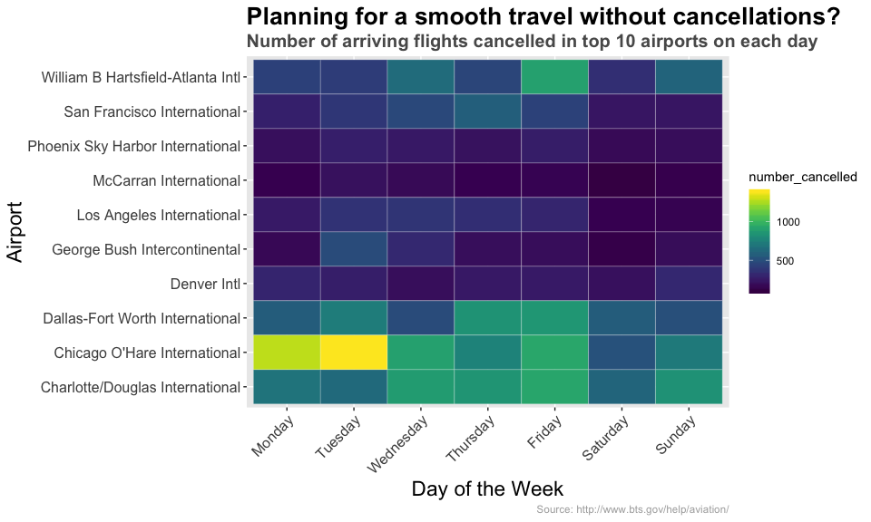

It can be seen from the above heatmap that there are over 300-400 arriving flights cancelled in 2018 in the following airports. Please note that this represents cumulative cancellations in the whole year on a particular day of the week.

-   George Bush Intercontinental on Tuesday
-   Charlotte/Douglas International on Wednesday and Thursday
-   William B Hartsfield-Atlanta Intl on Wednesday
-   LaGuardia on Thursday

### Figure 4.4.5 : Choropleth: Number of Cancellations per state (both inbound + outbound)

``` r
# Counting the number of cancellations per state for both Inbound and Outbound flights
df_statewise_can_arr <- group_by(df,Reporting_Airline,OriginStateName) %>% summarise_at(vars(Cancelled), funs(sum(., na.rm=TRUE))) %>%  group_by(OriginStateName) %>% summarise(value = sum(Cancelled))
df_statewise_can_dep <- group_by(df,Reporting_Airline,DestStateName) %>% summarise_at(vars(Cancelled), funs(sum(., na.rm=TRUE))) %>%  group_by(DestStateName) %>% summarise(value = sum(Cancelled))

names(df_statewise_can_arr)[1] <- "region"
names(df_statewise_can_arr)[2] <- "In_can"
names(df_statewise_can_dep)[1] <- "region"
names(df_statewise_can_dep)[2] <- "Out_can"

# Merging the dataframes for Inbound and Outbound flights
df_can <- merge(x = df_statewise_can_arr,y=df_statewise_can_dep,on="region",all=TRUE)
df_can$value <- df_can$In_can + df_can$Out_can
df_can$region  <- tolower(df_can$region)

names(ms_df_tot)[4] <- 'num' # number of flights
names(df_del)[5] <- 'del' # Number of Delays
names(df_can)[4]<- "can" # Number of cancelations

# Calulcating the average delay per flight per state and the percentage of cancellations
df_ratio <- merge(x = ms_df_tot,y=df_del,by="region",all=TRUE) %>%merge(y=df_can,by="region",all=TRUE) 
df_ratio$del_ratio <- df_ratio$del / df_ratio$num 
df_ratio$can_per <- df_ratio$can *100 / df_ratio$num 

del_rat <- c("region","del_ratio")
del_rat_df <- df_ratio %>% subset(select = del_rat)
names(del_rat_df)[2] <- "value"

per_can <- c("region","can_per")
can_per_df <- df_ratio %>% subset(select = per_can)
names(can_per_df)[2] <- "value"

# Plotting the percenatage of cancellations per state
state_choropleth(can_per_df,legend = "Percentage of Cancellations", num_colors = 9) +
  ggtitle("Which states have the highest flight cancellation percentages?", 
          subtitle = "Percetange of cancellations for diffrent state in 2017")+
  labs(caption = "Source: http://www.bts.gov/help/aviation/") +  
  theme(plot.title = element_text(face = "bold")) +
  theme(plot.subtitle = element_text(face = "bold", color = "grey35")) +
  theme(plot.caption = element_text(color = "grey68"))
```

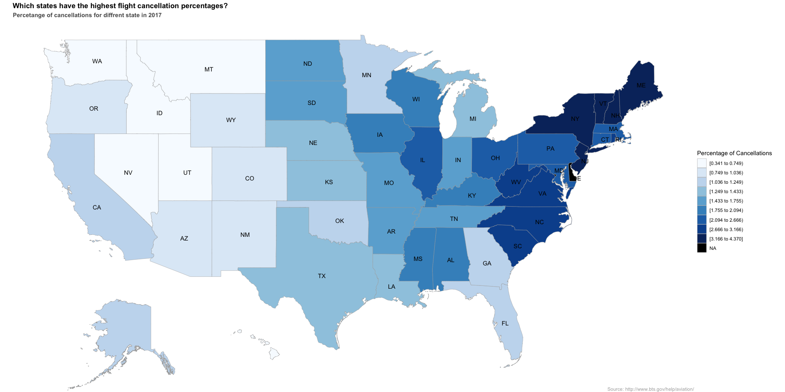

-   A similar pattern for the percentage of cancellations occurs when comparing with the ratio of delays.
-   Florida has a rather higher delay statirstic, but the number of cancellations is pretty low.

4.5. Distance
-------------

In this small subsection, we wil look at what distances are covered by the airlines.

### Figure 4.5.1 : BoxPlot ( Flight Time with Distance Group )

``` r
airlines1 <- airlines
airlines1$DistanceGroup = as.factor(airlines$DistanceGroup)

airlines1$DistanceGroup <- recode(airlines1$DistanceGroup, "1"="0-250", "2"="250-500", "3"="500-750", "4"="750-1000", "5"="1000-1250", "6"="1250-1500", "7"="1500-1750", "8"="1750-2000", "9"="2000-2250", "10"="2250-2500", "11"="2500-2750")
ggplot()+
    geom_boxplot(mapping=aes(x=DistanceGroup,y=ActualElapsedTime),data=airlines1)+
    ggtitle("Flight duration as a function of distance") +
    labs(x="Distance range in miles",y = "Flight duration in minutes", caption = "Source:http://www.bts.gov/help/aviation/")+
    theme(plot.title = element_text(face = "bold",size=20)) +
    theme(plot.subtitle = element_text(face = "bold", color = "grey35",size=15)) +
    theme(plot.caption = element_text(color = "grey68"))+
    theme(axis.text.x = element_text(angle = 45, hjust = 1, size=12)) +
    theme(axis.text.y = element_text(size=12)) +
    theme(axis.title.x = element_text(size=17)) +
    theme(axis.title.y = element_text(size=17)) 
```

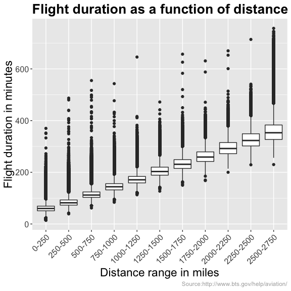

The above box plot shows the distribution of flight duration for each of the distance groups.

-   It can be seen that there are a lot of outliers in each case. For example, consider the outliers of distance group 1.
-   They match the average duration taken by flights in distance group 5 and 6.
-   This raises curiosity in the observer as to what might be happening with each of those flights that are outliers.
-   It can be perceived as the kind of route each of those flights take to cover the distance.
-   It can also be associated with the type of aircraft that is flown. Old models tend to fly with less speed. 

### Figure 4.5.2 : Mosaic Plot - Distance Group vs Airline

``` r
# mosaic of distance vs airline

ms <- c("DistanceGroup","Reporting_Airline")

ms_df <- df %>% select(ms) %>% group_by(Reporting_Airline,DistanceGroup) 

# Reordering the airlines on the basis of number of flights
ms_df$Reporting_Airline <- as.factor(ms_df$Reporting_Airline)
ms_df$Reporting_Airline <- reorder(ms_df$Reporting_Airline,x=ms_df$Reporting_Airline,FUN = function(x) - length(x))

# Plotting the mosaic plot of airlines vs reporting group
ggplot(ms_df) + geom_mosaic(aes(x=product(DistanceGroup,Reporting_Airline)),fill="Black") + xlab("Airline") + ylab("Distance Group") + theme_gray(16) + 
  labs(title="How far do the airline carriers fly?",
       caption = "Source: http://www.bts.gov/help/aviation/",
       subtitle = "Mosaic plot of Airline vs Reporting Group") +  
  theme(plot.title = element_text(face = "bold")) +
  theme(plot.subtitle = element_text(face = "bold", color = "grey35")) +
  theme(plot.caption = element_text(color = "grey68"))
```

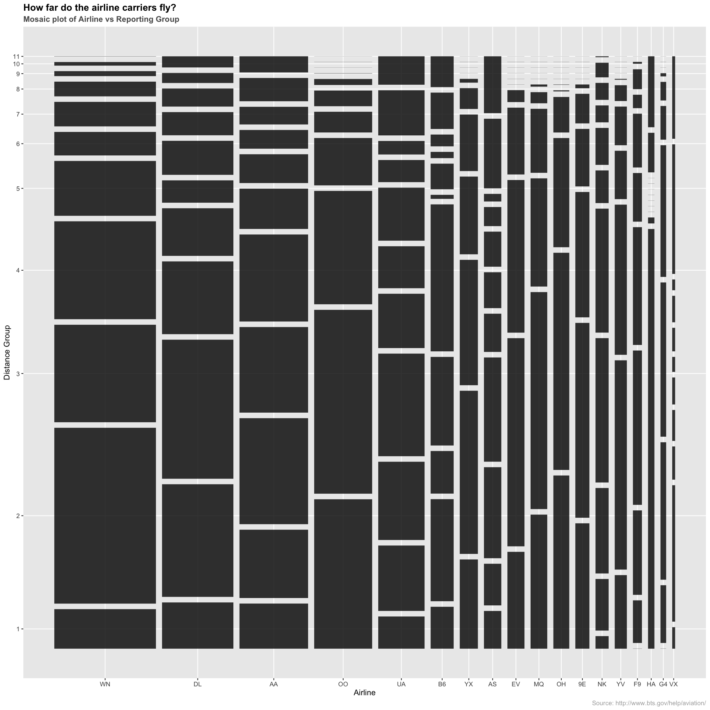

-   Some airline such as Hawaii Airlines have no middle range flights, but rather services intra-hawaii flights and flights to continental USA.
-   Some carriers such as UA, WN,YX, EV, MQ, OH etc. have lesser number of flights servicing long distance flights.
-   OO ( or SkyWest Airlines ) primarily services small distance flights.

5. Executive Summary
====================

The exhaustive results of our analysis can be broadly summed up by the three graphs below.

### Figure 5.1 : Reasons of Flight Cancelllation of Top 3 Airlines at 10 Busiest Airports

``` r
top3airlines <- c("AA","OH","OO")
subset3 <- subset1 %>% filter(Origin %in% top10aircodes, Reporting_Airline %in% top3airlines)

subset3$Reporting_Airline <- as.factor(subset3$Reporting_Airline)
levels(subset3$Reporting_Airline) <- c("American", "PSA Airline", "Skywest")

ggplot(subset3, aes(x= Origin, fill=CancellationCode))+
  geom_bar(position = "dodge")+
  facet_wrap(~Reporting_Airline)+ 
  ggtitle("Why do flights get cancelled?",
          subtitle = "Reasons of Flight Cancellation of 3 Airlines at the 10 Busiest Airports") +
  labs(y = "No. of Flights", caption = "Source: bts.transtats.gov") +
  theme(plot.title = element_text(face = "bold")) +
  theme(plot.subtitle = element_text(face = "bold", color = "grey35")) +
  theme(plot.caption = element_text(color = "grey68"))+
  theme(axis.text.x = element_text(angle = 45, hjust = 1))+
  theme(axis.ticks.x = element_blank() ,axis.ticks.y = element_blank())
```

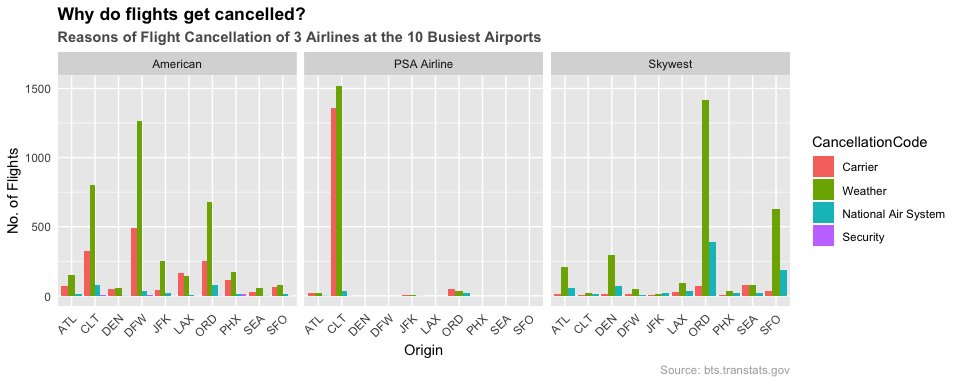

The graph shows the reason for flight cancellation in the top Airports. We have picked up 3 Airlines which showed interesting results.

-   The general trend of cancellations in the United States is directly related to the weather conditions. This trend is quite visible in the 3 graphs. The weather-related cancellations are high in Dallas/Ft Worth Airport and Chicago's O'Hare International Airport.

-   Another interesting trend is seen in the second graph for PSA Airline. It is seen that the cancellations are high for PSA in Charlotte Douglas International Airport North Carolina. Though this can be attributed to the fact that CTL airport is the main hub for PSA airline, we cannot ignore the fact that many of the cancellations are due to carrier problems and not the weather. We can use this fact to infer that PSA Airline might not be a reliable airline to opt for in case we have a choice.

-   Another trend that can be seen is that Skywest Airlines has lots of cancellations due to National Air System (Airport related issues like heavy air traffic, glitches in the air traffic controller room, airport troubles ) compared to other airlines. This may be because Skywest airline caters to the need of tier 2 and other small airports/cities. We believe that cancellations are more frequent for Skywest than others as airports are trying to minimise the cancellations of aircraft flying to larger cities to avoid a cascading effect which may disrupt a lot of future flights schedules.

### Figure 5.2 : Flight cancellations at JFK and LGA in last 5 Decembers

``` r
decset3 <- decset1 %>% filter(Origin %in% c('JFK','LGA')) %>% 
  group_by(Year,DayofMonth, CancellationCode) %>% 
  summarise( count = n() )

ggplot(decset3, aes(x=DayofMonth, y = count, color= CancellationCode))+ 
  geom_line() + 
  facet_wrap(~Year)+
  ggtitle("JFK and LGA are a safe bet this December",
          subtitle = "Flight cancellations at JFK and LGA in last 5 Decembers") +
  labs(y = "No. of Flights",x = " Day of the Month", caption = "Source: bts.transtats.gov") +
  theme(plot.title = element_text(face = "bold")) +
  theme(plot.subtitle = element_text(face = "bold", color = "grey35")) +
  theme(plot.caption = element_text(color = "grey68"))+
  theme(axis.text.x = element_text(angle = 45, hjust = 1))
```

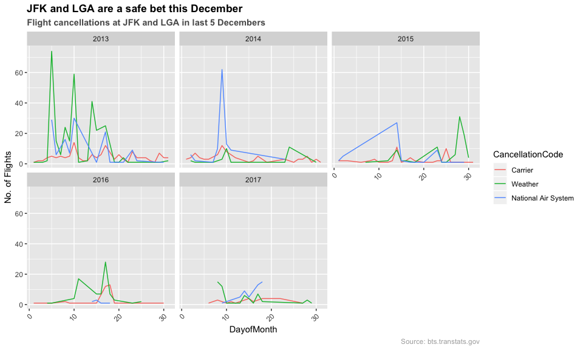

Continuing with cancellations, let's go more local, and check out the trend in cancellation of flights in New York City, to see what was the reason here. Let us see if it is safe to travel from NYC this Holiday season! We have data from the last five years.

-   It looks like 2013 was a very bad year for a traveller as lots of flights got cancelled in the first half of December.
-   2014 was a better year in terms of weather-related cancellations, but from the 8th to 10th of December 2014, there were multiple cancellations because of National Air System (NAS).
-   In 2015, The cancellations were less frequent, similar to 2014, the first part of December was affected by technical NAS issues, while the holiday season was affected by weather.
-   2016 was a surprising year. The flight cancellations due to NAS drastically decreased in this period. This is probably because the number of flights operations at JFK were restricted and enforced in the year 2016, which probably decreased the number of flights cancellations due to NAS. Link: <https://www.federalregister.gov/documents/2016/06/21/2016-14631/operating-limitations-at-john-f-kennedy-international-airport>
-   2017 was, in general, a good year in terms of flights cancelled due to weather.

### Figure 5.3 : Bar Chart: Count of Delay/On time/Before Time for \[ New York \]

``` r
# Chart 3 for departing/outbound flights for JFK

df_dvg3 <- df %>% subset(OriginCityName=="New York, NY") %>% group_by(Month,dep_cat) %>% summarize(n())
names(df_dvg3)[3] <- "count"
df_dvg3 <-df_dvg3 %>% drop_na()
df_dvg3$dep_cat <- as.factor(df_dvg3$dep_cat)
df_dvg3$Month <- as.factor(df_dvg3$Month)

df_dvg3$Status[df_dvg3$dep_cat==0] <- "On Time"
df_dvg3$Status[df_dvg3$dep_cat==1] <- "Delayed"
df_dvg3$Status[df_dvg3$dep_cat==-1] <- "Before Time"

ch3 <- ggplot(df_dvg3,aes(x=Month,y=count,fill=Status)) + geom_bar(stat = "Identity",position="dodge") + 
  ylab("Frequency") + 
  theme_gray(16) +
  labs(title="What is the performance of flights departing from New York City?",
       caption = "Source: http://www.bts.gov/help/aviation/",
       subtitle = "Outbound Delay per month for New Yok City") +  
  theme(plot.title = element_text(face = "bold")) +
  theme(plot.subtitle = element_text(face = "bold", color = "grey35")) +
  theme(plot.caption = element_text(color = "grey68"))+
  theme(axis.ticks.x = element_blank() ,axis.ticks.y = element_blank())
#ggsave("Outbound Delay per month for NYC.png")

# Chart 4 for arriving/inbound flight for JFK

df_dvg4 <- df %>% subset(DestCityName=="New York, NY") %>% group_by(Month,arr_cat) %>% summarize(n())
names(df_dvg4)[3] <- "count"
df_dvg4 <-df_dvg4 %>% drop_na()
df_dvg4$arr_cat <- as.factor(df_dvg4$arr_cat)
df_dvg4$Month <- as.factor(df_dvg4$Month)

df_dvg4$Status[df_dvg4$arr_cat==0] <- "On Time"
df_dvg4$Status[df_dvg4$arr_cat==1] <- "Delayed"
df_dvg4$Status[df_dvg4$arr_cat==-1] <- "Before Time"

#head(df_dvg4 %>% drop_na())

ch4 <- ggplot(df_dvg4,aes(x=Month,y=count,fill=Status)) + 
  geom_bar(stat = "Identity",position="dodge") + 
  ylab("Frequency") + 
  theme_gray(16) +
  labs(title="And arriving flights?",
       caption = "Source: http://www.bts.gov/help/aviation/",
       subtitle = "Inbound Delay per month for New York City") +  
  theme(plot.title = element_text(face = "bold")) +
  theme(plot.subtitle = element_text(face = "bold", color = "grey35")) +
  theme(plot.caption = element_text(color = "grey68"))+
  theme(axis.ticks.x = element_blank() ,axis.ticks.y = element_blank())

grid.arrange(ch3, ch4, nrow = 1)
```

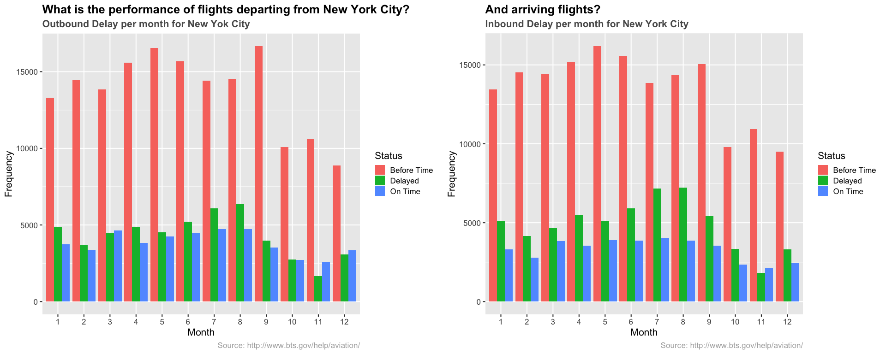

Cancellations are not the only thing affecting the passengers! Delay is also a stress creator. Let us look at the number of flights delayed for outbound and inbound flights. We can see an obvious pattern in the number of flights operated over the months

-   There is a higher number of flights operating in summer and a lesser number of flights in winter. This shows that people prefer to travel more in the summers and less in the winters.
-   The two peaks of the data are observed around May and September which coincide with the ending and beginning academic calendars of the college and schools across the US.

Part 6. Interactive component
========================

Link: <https://s3.us-east-2.amazonaws.com/howamericaflies/lookbeforeyoubook.html>

**Features of the Tool**

-   Flight information from October 1st 2017 to September 31st 2018 for the top 10 cities in the United States.
-   The dataset was obtained from United States Department of Transportation
-   Option to check for flight details for any month of the year.
-   The Information panel on the right gives Information on all the flights from all airport from City A to City B.
-   A hover on the flight path gives the best option flight (Minimum 30 flights a month and with lowest delay) for that particular route

**Who is this tool for?**

-   Cautious air travelers, who want to check delay of a particular airline in a particular month for a particular route before booking their tickets
-   Airline companies, who want to find out who their competitors are in a particular route and would like to analyze the current situation before taking decisions like more fleet deployment or reverting particular flights to operate on different routes.
-   Air traffic controllers, who would want to optimize their strategy to reduce delay.
-   Data Scientist and Analysts, who would want to find pattern between delay in a particular route and factors like weather, natural disaster or failing performance of an airline.
-   Policy decision makers, on deciding if they want to expand airport
-   Anybody else, who is interested in finding patterns between Airlines, routes, and delays

**How was the product developed?**

-   Data was collected for the time period October 1st 2017 to September 31st 2018
-   Python was used to process the csv file into a dictionary
-   The dictionary was then used in the d3 script to show flights and delays Vision Websites like Google flights and Expedia are quite commonly used to book flight tickets today. But the websites only tell the customer about the flight timings and cost of travel. The customer has no knowledge about the historical delays that the flight has on the particular route. So, we decided to design a website which gives the user information about the delay in flights and its patterns so that he/she can make an informed choice

**What did we want to do but could not do ?**

-   Cosmetics. We tried to add cosmetic changes like bold/colors/font to the Information Desk on the right side of the page. But we were not able to add those because the text tag on top of SVG was not letting any CSS changes. So, we had to take a decision on whether cosmetics was important to us or the alignment (info desk to the right of the map) and usability and decided that alignment and usability was more important as we did not want the user to scroll down or side to look the information that out application provided.
-   Use data directly from the csv files: We tried to include the route file directly from the csv file and process in JavaScript, but could not do it as the processing was time consuming due to the sheer size of data. So ultimately, we have to resort to use the data in the form of dictionaries preprocessed beforehand by python.

**What is the future scope of the interactive plot ?**

-   Include a greater number of cities. Probably cover all the cities which have an airport in the United States.
-   Receive and process data directly from CSVs instead of using a dictionary preprocessed using python programing OR
-   Create APIs in python and call them in the JavaScript/D3 file. This can help us process the data faster in python and directly connect to US Dept of transportation website and get updated data directly from there.
-   Create a drop down for year so that that the users of the application could look at delay and airline patterns from different time periods (The US Department of transportation has data from 1989 to present.

Part 7. Conclusion
=============

In this section, we will look at the limitations that we faced, as the Future direction and vision of the project.

**Limitations**

As the problem statement that we picked was something that we were interested, the team was really excited to work on the data. In the course of performing the data analysis and preparing the Visualisation tool, we came accross many limitations

-   International On-Time performance Data : We wanted to actually work on the international data rather than a localised data, but as international data was hard to get, we had to restrict ourselves to United States.

-   Reporting Airline vs. Marketing airlines : The data that we were looking for was Marketing airline dataset and not Reporting Airlines. As mentioned in the report above, Skywest Airlines operates as Delta, American and United Airlines. So we could not relate whether The Skywest was operating as Delta, American or United Airlines, which may have created discrepancies in our analysis

-   We have analysed only direct flights in this project. We will have to search for connecting flight data as well and bring out interesting insights

**Challenges faced and Lessons learnt**

-   Colaborations with different members of the team was tough and the team handled it really well.

-   Initiation of the project was challenging, it was time consuming but we bounced back.

**Future Direction**

-   As explained in the interactive component section, we can add more elements and functionality to make the "Look Before You Book" tool interactive.

-   We would want to expand the functionality for choosing international destinations in the D3 components.

-   Data analysis on international delays and cancellations can bring out unique and exciting insights in data.

-   Data analysis can be done on the connecting flights. This analysis may require additional data which is currently not readily available and generally exists behind a paywall.
